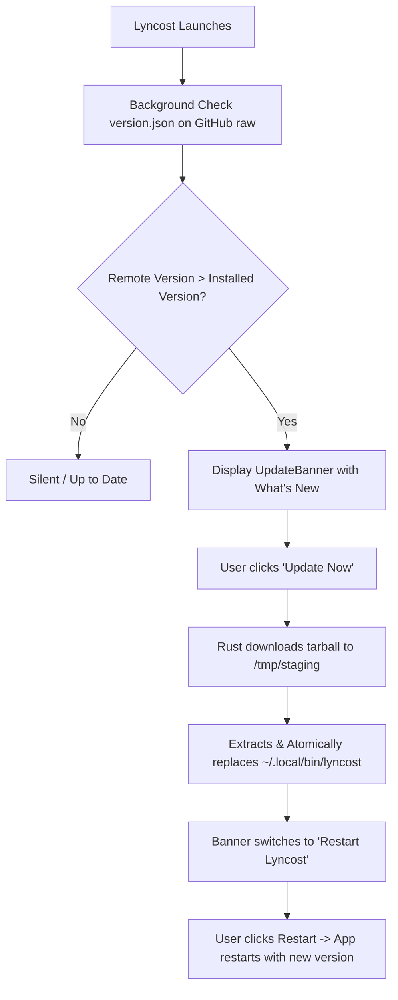

# 🐧 Lyncost — Master Project & Architecture Guide
> **Purpose of this document:** Complete, step-by-step documentation of Lyncost's architecture, release model, version sequencing, in-app update pipeline, and recent history. Designed for both human developers and AI assistants to pick up context immediately.

---

## 1. Project Overview

* **Application Name:** Lyncost
* **Repository:** [`raizenquick/lyncost`](https://github.com/raizenquick/lyncost)
* **Website:** [`lyncost.vercel.app`](https://lyncost.vercel.app) ([`raizenquick/lyncost-website`](https://github.com/raizenquick/lyncost-website))
* **License:** GNU General Public License v3.0 (`GPL-3.0`)
* **Philosophy:** 100% Offline-First • Zero Telemetry • Double-Entry SQLite Ledger • Private Financial Vault
* **Target Platform:** Native Linux Desktop (x86_64, Wayland & X11)

### Tech Stack
* **Shell/Backend:** Tauri v2 (Rust 2021)
* **Frontend:** React 19 + TypeScript (strict mode, zero `any`) + Vite + TailwindCSS v4
* **State Management:** Zustand
* **Embedded Database:** SQLite via `rusqlite` (bundled)
* **Data Visualization:** Recharts
* **Icons:** `lucide-react`

---

## 2. Universal 1-Line Installation & Distribution Model

Lyncost does **not** use fragmented package formats (`.deb`, `.rpm`, `.pkg.tar.zst`, or Flatpak). It utilizes a streamlined, universal Linux terminal distribution model that installs cleanly into user space without requiring root or `sudo` privileges.

### Fast Install / Update Command
```bash
curl -fsSL https://raw.githubusercontent.com/raizenquick/lyncost/main/install.sh | bash
```

### Clean Uninstall Command
```bash
curl -fsSL https://raw.githubusercontent.com/raizenquick/lyncost/main/uninstall.sh | bash
```

### Installation File Locations
* **Executable:** `~/.local/bin/lyncost`
* **Desktop Launcher:** `~/.local/share/applications/lyncost.desktop`
* **Application Icons:** `~/.local/share/icons/hicolor/<size>x<size>/apps/lyncost.png`
* **Database / Data Storage:** `~/.local/share/lyncost/` (or OS standard app data dir)
  * *Crucial Principle:* The database file is **never** touched or modified by updates or reinstalls.

---

## 3. In-App Automatic Update System & Version Sequencing

Lyncost features a fully automated, native in-app update check and 1-click update pipeline.



### 3.1 The Version Source of Truth: `version.json`
Located at the root of the repo and served via GitHub raw:
```json
{
  "version": "0.1.1",
  "release_date": "2026-09-07",
  "notes": "Added Quick Balance Privacy Mask toggle in header and v0.1.1 performance polish!",
  "tarball_url": "https://raw.githubusercontent.com/raizenquick/lyncost/main/dist-packages/lyncost-0.1.1-linux-x86_64.tar.gz"
}
```

### 3.2 Rust Backend Architecture (`src-tauri/src/commands.rs`)
1. **`check_app_update()`**:
   - Queries `https://raw.githubusercontent.com/raizenquick/lyncost/main/version.json` using `curl` with a 4s connection timeout.
   - Compares current compiled version (`env!("CARGO_PKG_VERSION")`) against `latest_version` using a semantic versioning helper (`is_version_greater`).
   - Returns `AppUpdateInfo` struct with update availability, notes, and tarball URL.
   - If offline or unreachable, fails silently and returns `has_update: false`.

2. **`install_app_update(download_url)`**:
   - Creates a clean staging directory in `/tmp/lyncost_update_staging/`.
   - Downloads the release tarball using `curl -fsSL`.
   - Extracts using `tar -xzf`.
   - Automatically searches for the executable binary `lyncost` directly and in nested archive folders.
   - Writes to staging binary `~/.local/bin/lyncost.new`, applies executable permissions (`chmod 0o755`), and atomically renames over `~/.local/bin/lyncost`.
   - Cleans up `/tmp`.

3. **`restart_application()`**:
   - Calls Tauri v2's native `app.restart()` to relaunch the running process seamlessly.

### 3.3 Frontend Integration
* **Store (`src/store/useAppStore.ts`):** `initApp()` calls `checkForAppUpdate()` asynchronously in the background so app startup time is zero-delayed.
* **Top Banner (`src/components/UpdateBanner.tsx`):** Renders dynamically when `updateInfo?.has_update` is true. Features instant `[Update Now]` progress state and green pulsing `[Restart Lyncost]` prompt upon completion.
* **Settings Tab (`src/pages/SettingsPage.tsx`):** Houses a dedicated **Software Version & In-App Updates** card where users can manually click `[Check for Updates]`.

---

## 4. How to Release the Next Version (Developer Workflow)

Follow this exact sequence whenever publishing an update (e.g. `0.1.1` $\to$ `0.1.2`):

### Step 1: Bump Version Numbers in 4 Files
1. **`package.json`**: `"version": "0.1.2"`
2. **`src-tauri/Cargo.toml`**: `version = "0.1.2"`
3. **`packaging/build_packages.sh`**: `VERSION="0.1.2"`
4. **`version.json`**:
   ```json
   {
     "version": "0.1.2",
     "release_date": "YYYY-MM-DD",
     "notes": "Description of fixes and new features...",
     "tarball_url": "https://raw.githubusercontent.com/raizenquick/lyncost/main/dist-packages/lyncost-0.1.2-linux-x86_64.tar.gz"
   }
   ```

### Step 2: Build and Package
Run these two commands in `~/Projects/lyncost`:
```bash
npm run release
bash packaging/build_packages.sh
```
*This compiles the optimized release binary and bundles `dist-packages/lyncost-0.1.2-linux-x86_64.tar.gz` alongside updated `dist-packages/SHA256SUMS`.*

### Step 3: Commit and Push to GitHub
```bash
git add -A
git commit -m "release: v0.1.2 — <Brief description>"
git push origin main
```

**That's it!** All existing Lyncost installations worldwide will automatically detect `v0.1.2` upon their next launch and offer the 1-click update.

---

## 5. Summary of Recent Milestones & Changes

| Milestone / Change | Description |
| :--- | :--- |
| **Apple-Inspired Design System** | Fluid Day and Night modes with high-contrast text, subtle neon royal purple border accents, and neumorphic cards. |
| **Single Universal Installer** | Removed `.deb`, `.pkg.tar.zst`, `.flatpak`, and Windows `.exe`/`.msi` packages. Replaced with single terminal curl install & uninstall scripts. |
| **GitHub Releases Cleanup** | Cleaned release `v0.1.0`, purged legacy package assets, synced repository "About" description, tags/topics, and website URL. |
| **Buy Me a Coffee Widget** | Embedded floating support widget on the official website ([`lyncost.vercel.app`](https://lyncost.vercel.app)). |
| **In-App Auto Updater** | Implemented background update check, top banner notification, non-root binary replacement, and application restart. |
| **Version v0.1.1 Release** | Bumped version to `0.1.1`, added `v0.1.1` badges in Sidebar and Dashboard, and introduced the **Privacy Mode** balance masking toggle (`••••••`). |

---

## 6. Key Directory Structure & File Map

```
lyncost/
├── dist-packages/                   # Tracked release tarballs & SHA256 hashes
│   ├── lyncost-0.1.0-linux-x86_64.tar.gz
│   ├── lyncost-0.1.1-linux-x86_64.tar.gz
│   └── SHA256SUMS
├── packaging/
│   ├── build_packages.sh            # Packages binary into universal tarball
│   └── lyncost.desktop              # Linux desktop launcher specification
├── src/                             # React frontend
│   ├── components/
│   │   ├── Sidebar.tsx              # Navigation sidebar with brand & v0.1.1 badge
│   │   ├── UpdateBanner.tsx         # Floating update notification banner
│   │   └── ...
│   ├── pages/
│   │   ├── Dashboard.tsx            # Financial dashboard with Privacy Mode toggle
│   │   ├── SettingsPage.tsx         # Settings & in-app update management card
│   │   └── ...
│   ├── store/
│   │   └── useAppStore.ts           # Central Zustand store (calls Tauri invoke)
│   ├── types/                       # TypeScript models and interfaces
│   ├── App.tsx                      # App root component
│   └── main.tsx                     # Entry point
├── src-tauri/                       # Rust backend
│   ├── src/
│   │   ├── commands.rs              # Tauri command handlers (including update commands)
│   │   ├── db.rs                    # SQLite migrations and connection pooling
│   │   ├── models.rs                # Rust data structures (including AppUpdateInfo)
│   │   ├── lib.rs                   # Tauri builder & invoke handler registry
│   │   └── main.rs                  # Native entry point
│   ├── Cargo.toml                   # Rust dependencies & package version
│   └── tauri.conf.json              # Tauri application configuration
├── install.sh                       # Universal one-line curl install script
├── uninstall.sh                     # Universal one-line curl uninstall script
├── version.json                     # Dynamic version specification & release notes
├── PROJECT_GUIDE.md                 # This master documentation file
└── README.md                        # User-facing repository overview
```

---

## 7. Golden Rules for Developers & AI Agents

1. **Strict Double-Entry Ledger:** Never write directly to `accounts.current_balance`. Always record a transaction ledger entry and compute balances via SQLite transaction.
2. **Offline-First Privacy:** Never add remote telemetry, external tracking beacons, or required cloud accounts. Network requests are strictly limited to checking `version.json` and downloading release packages upon explicit user consent.
3. **TypeScript Strictness:** Never use `any`. Verify `tsc && vite build` and `cargo check` before committing.
4. **No Root Needed:** All installer and updater actions must operate in user space (`~/.local/`).
